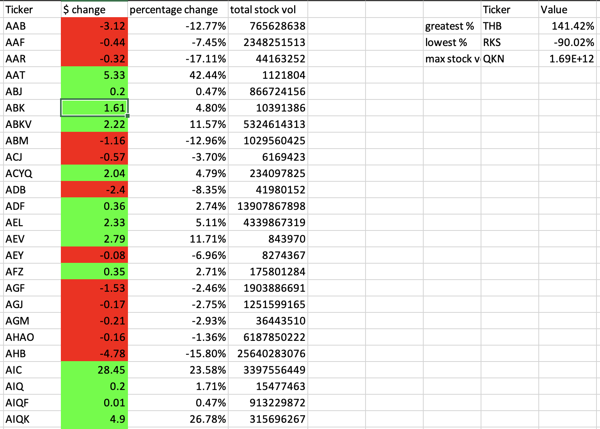

# stock_analysis summary

The first thing I did was to iterate through all of my worksheets using a for each WS

Then I iterated through the tickers and made an If conditional where if my ticker changed, I stored the current ticker's last day's closing value and stored the NEXT ticker's first day opening value. 

I did a subtraction (closing value - opening value) to get the difference 

I declared the new values to a new column were I wrote the ticker in question, the yearly change in dollars, the percentage change, and the total stock volume for each ticker in that year. 

Then, I did another iteration to go through the new menu to discover which ticker had the most percentage increase, and which one had the most negative increase and added their value. Also I summed up the total stock volume for all of the tickers.

Finally I made sure it worked on my original data since I was using a test version so the script would run faster while developing. 

Here are the final results of the code in my original data. 

